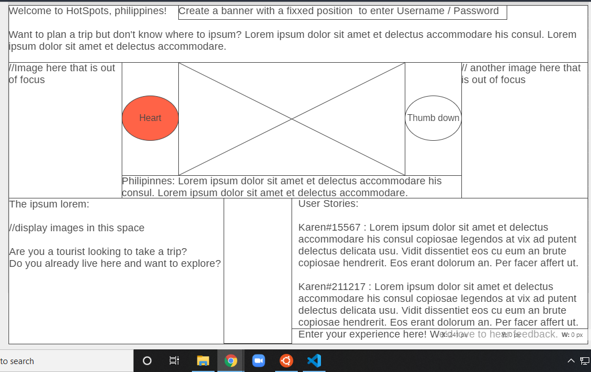
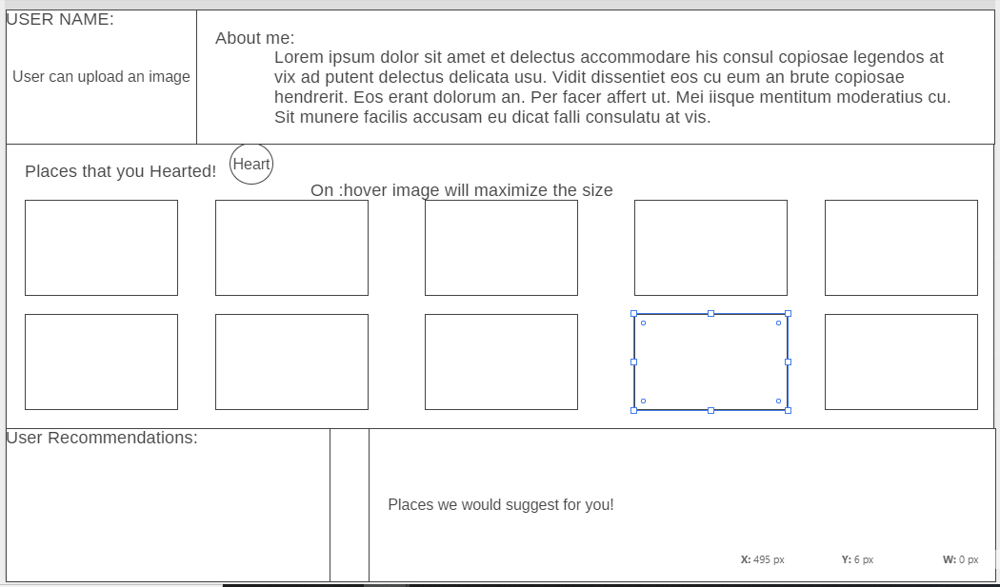
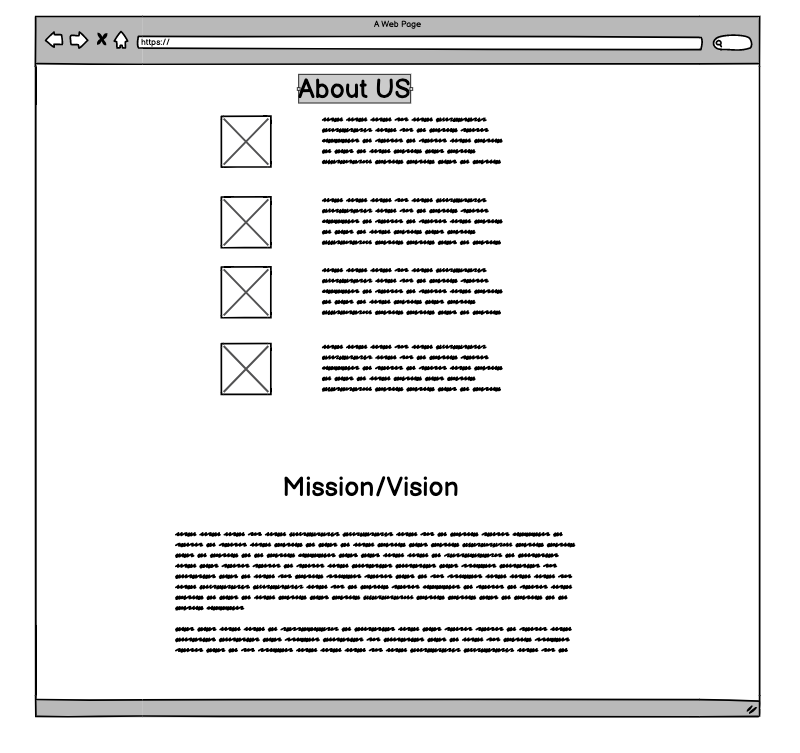
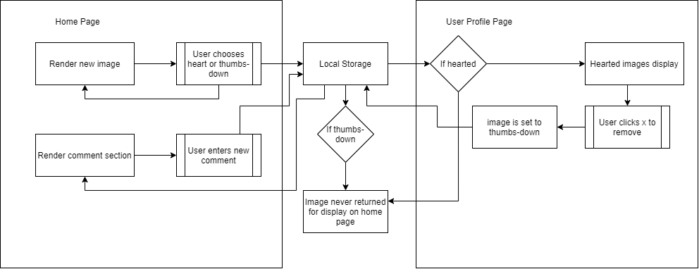

# Team Kraken

This project is created by:
**Darius Lee Pasilaban**, 
**Jack Nelson**,
**Matthew Petersen**,
 and **Jae Choi**.

[Click here](UserStories.md) to see our User Stories!

# Here is our wire-frame:

## Initial Page / Dashboard

## User Profile

## About Us

# FlowChart

## W3 School https://www.w3schools.com/howto/tryit.asp?filename=tryhow_js_toggle_dark_mode ##

## Image Reference

    [Kayangan Lake](https://i.pinimg.com/originals/43/dd/38/43dd38a7943ebc2cec5729704265bd3b.jpg)

    [Puerto Princesa Subterranean River National Park](https://static.thousandwonders.net/Puerto.Princesa.Subterranean.River.National.Park.original.330.jpg)

    [Barracuda Lake](https://4.bp.blogspot.com/_FKFkwWzE50g/TPpnwbs-6nI/AAAAAAAADKg/xScPV-WhIXU/s1600/Kayangan%2BLake-9.jpg)

    [Tubbataha Reef](https://www.nationalgeographic.com/content/dam/photography/PROOF/2017/November/tubbataha-rolex/14-tubbataha-reef-philippines.jpg)

    [Nacpan Beach](https://apenoni.com/wp-content/uploads/2016/08/Nacpan-Beach-Palawan-Cover-min.jpg)

    [Big Lagoon](https://media2.trover.com/T/5b801b476c7034ab38007b4f/fixedw_large_4x.jpg)

    [Port Barton](https://www.travelimagez.com/wp-content/uploads/2017/04/Philippines-Palawan-Port_Barton-aerial-10.jpg)

    [Twin Lagoon](https://locationwolf.com/wp-content/gallery/aerial/Twin-Lagoon-El-Nido-Palawan-Philippines.jpg)

    [Ugong Rock Adventures](https://media-cdn.tripadvisor.com/media/attractions-splice-spp-720x480/09/a3/49/73.jpg)

    [Estrella Falls](https://media-cdn.tripadvisor.com/media/photo-m/1280/16/0c/0c/57/photo3jpg.jpg)